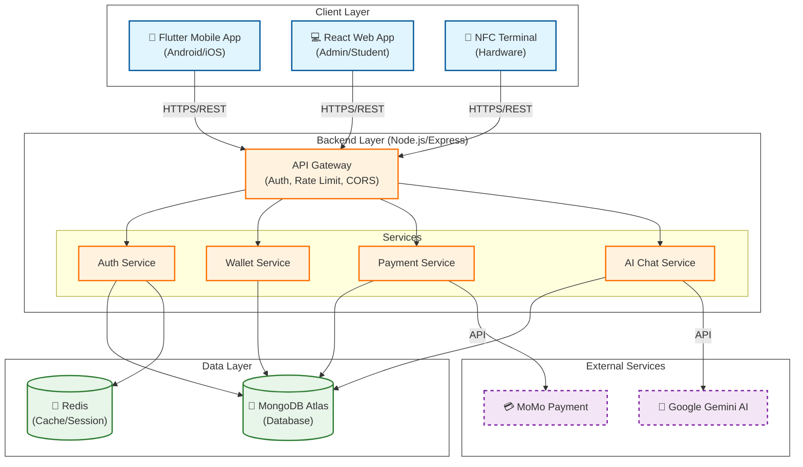
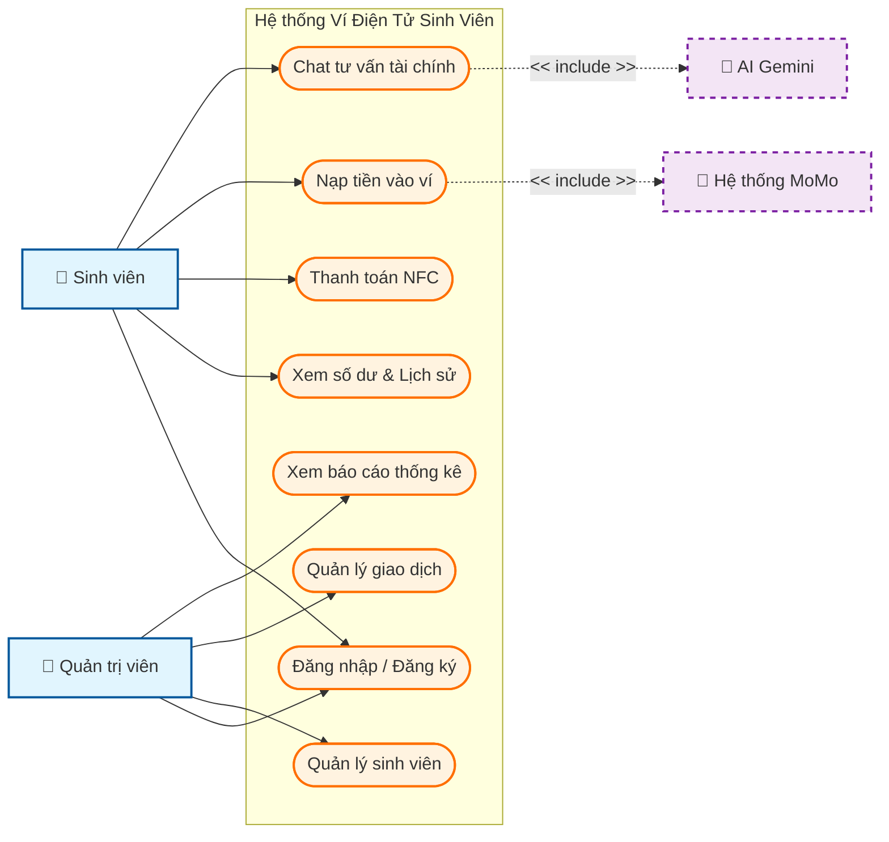
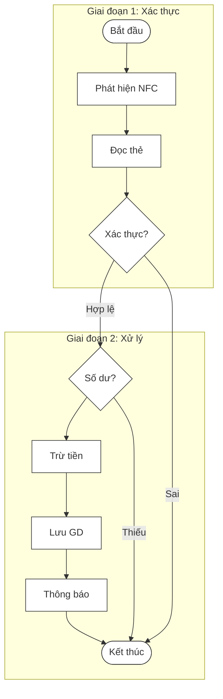
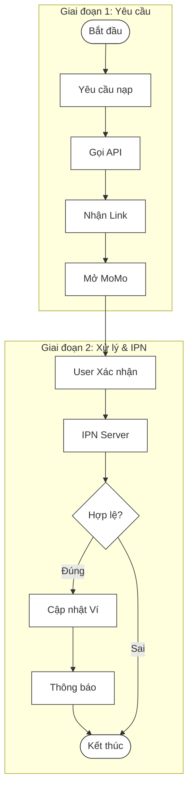
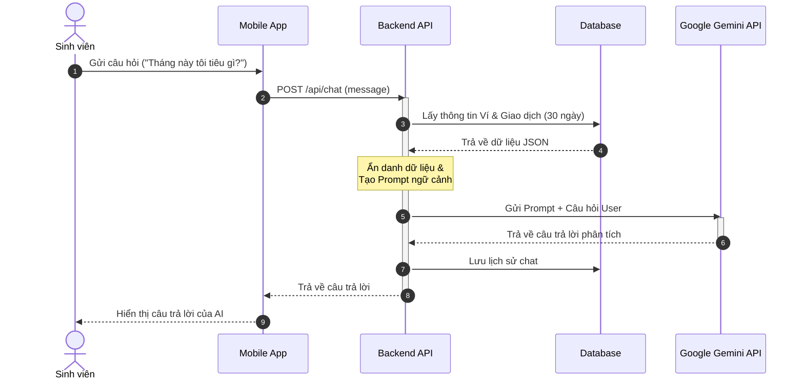
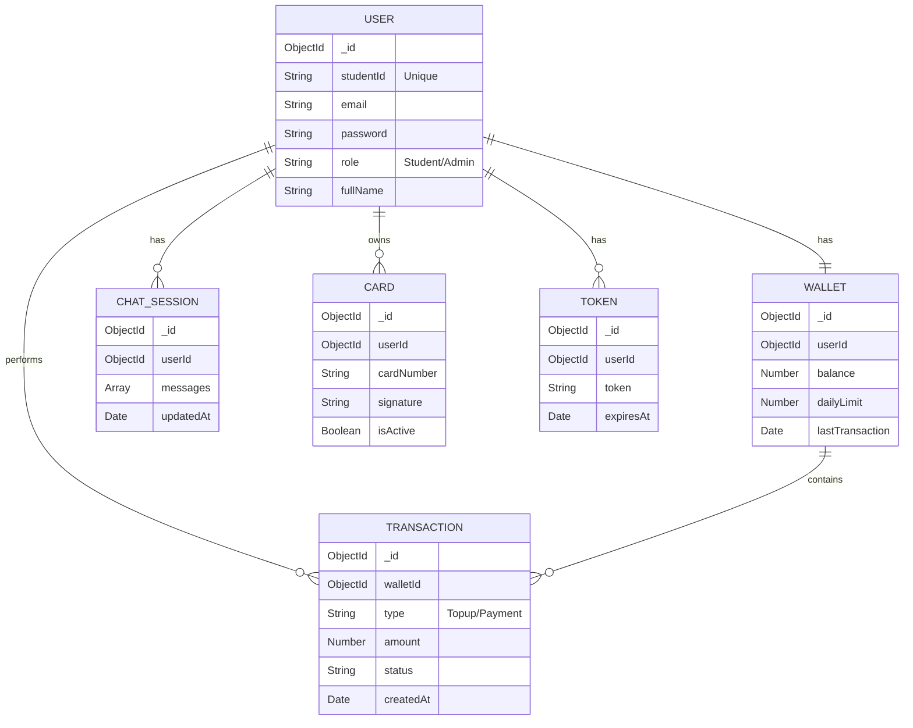

# HƯỚNG DẪN VẼ SƠ ĐỒ BÁO CÁO (Sử dụng Mermaid.js)

Tài liệu này cung cấp mã nguồn để vẽ lại các sơ đồ trong Báo cáo Đồ án bằng công cụ **Mermaid Live Editor**. Đây là cách nhanh nhất để tạo ra các sơ đồ chất lượng cao, đồng bộ và dễ dàng chỉnh sửa.

**Cách thực hiện:**
1. Truy cập: [https://mermaid.live/](https://mermaid.live/)
2. Sao chép (Copy) đoạn code tương ứng bên dưới.
3. Dán (Paste) vào khung "Code" bên trái của trang web.
4. Sơ đồ sẽ hiển thị bên phải. Bạn có thể tải xuống dưới dạng PNG hoặc SVG để chèn vào báo cáo.

---

## Hình 3.1: Sơ đồ Kiến trúc Hệ thống
*(Chưa có trong báo cáo, có thể thêm vào phần 3.2.2 Kiến trúc phần mềm và Công nghệ, mục 2 - Hình đề xuất: fig:sys_arch)*

---

## Hình 5.1: Sơ đồ Use Case Tổng quát
*(Tương ứng Figure label: fig:usecase_tongquat trong mục 5.1.1)*

---

## Hình 5.2: Sơ đồ hoạt động chức năng Thanh toán NFC
*(Tương ứng Figure label: fig:activity_nfc trong mục 5.2.1)*

---

## Hình 5.3: Sơ đồ hoạt động chức năng Nạp tiền MoMo
*(Tương ứng Figure label: fig:activity_momo trong mục 5.2.1)*

---

## Hình 5.4: Sơ đồ tuần tự chức năng Chat AI
*(Tương ứng Figure label: fig:sequence_ai trong mục 5.2.2)*

---

## Hình 6.1: Sơ đồ quan hệ cơ sở dữ liệu (ER Schema)
*(Tương ứng Figure label: fig:db_schema trong mục 6.3)*

